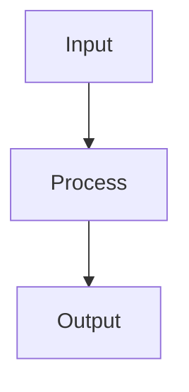

# workflow_builder

Turn a folder of Markdown files into a single interactive HTML page that guides your team through a multi-step workflow — step by step, with live command substitution and progress tracking.

---

## What problem does it solve?

When a workflow has many stages and commands, it's easy to lose track, copy the wrong value, or feel overwhelmed. **workflow_builder** turns your Markdown docs into a focused HTML page where:

- Commands update live as you fill in your paths and parameters
- You can copy any command with one click — no manual editing
- Each stage can be marked complete so you always know where you are
- Progress is saved, so refreshing the browser doesn't reset anything

---

## What you get

```
[ Stages sidebar ]  [ Step-by-step content ]  [ Parameters panel ]
```

| Area | What it does |
|---|---|
| Left sidebar | Lists all stages with `○` / `✓` progress indicators |
| Main content | Shows each stage's steps, commands, and diagrams |
| Right panel | Input fields for every `{{PARAMETER}}` — commands update live as you type |

---

## Project structure

```
workflow_builder/
├── build.py                  # The script you run
├── template.html             # HTML/CSS/JS template (no editing needed)
├── requirements.txt          # Optional: jinja2, markdown
└── sample_workflow/
    ├── 01_setup.md           # Example stage 1
    └── 02_process.md         # Example stage 2
```

---

## Quick start

### 1. Run the script

```
python build.py sample_workflow --output my_workflow.html
```

Output:

```
Written: C:\Users\you\...\workflow_builder\my_workflow.html
```

### 2. Open the HTML file in your browser

Double-click `my_workflow.html` — no server needed. Works fully offline (except Mermaid diagrams which need internet to render).

### 3. Fill in your parameters and follow the steps

- Type your folder paths in the **Parameters** panel on the right
- Commands update instantly across all steps
- Click **Copy** next to any command to copy it with your values filled in
- Click **Mark Complete** when a stage is done

---

## Pre-filling parameters from the command line

If you already know the values, pass them when generating the HTML. They become the starting defaults in the parameter panel:

```
python build.py sample_workflow --output my_workflow.html --param INPUT_DIR=C:\data\raw --param WORKERS=8
```

Users can still change these values in the browser — they're just pre-filled defaults.

---

## Writing your own workflow

### Step 1 — Create a folder for your workflow

```
my_workflow/
├── 01_prepare.md
├── 02_run.md
└── 03_review.md
```

Files are sorted by filename, so use a numeric prefix (`01_`, `02_`, ...) to control order.

---

### Step 2 — Write each stage file

Each `.md` file follows this structure:

```markdown
# Stage: Your Stage Name
A short description of what this stage does and why it matters.

### Step 1: Step Name
What this step does.

```bash
your-command --flag value
```

### Step 2: Another Step
Description here.

```bash
another-command
```
```

**Rules:**
- The first line must be `# Stage: Name`
- Steps start with `### Step N: Name` (the number is just for readability — any `###` heading works)
- Code blocks use triple backticks as usual
- Mermaid diagrams use ` ```mermaid ` blocks

---

### Step 3 — Add parameters for values that change per project

Use `{{PARAM_NAME}}` inside any command to mark it as a user-fillable value:

```bash
python run.py --input {{INPUT_DIR}} --output {{OUTPUT_DIR}}
```

To give a parameter a **default value**, use `=`:

```bash
python run.py --input {{INPUT_DIR}} --output {{OUTPUT_DIR=/tmp/output}} --workers {{WORKERS=4}}
```

The parameter panel will show these defaults pre-filled. If a user leaves a field blank, the command highlights the placeholder in orange so it's obvious something is missing.

**Example from the sample workflow:**

```bash
python process.py --input {{INPUT_DIR}} --output {{OUTPUT_DIR=/tmp/output}} --workers {{WORKERS=4}}
```

When the user types `C:\data\raw` into the `INPUT_DIR` field, the command instantly becomes:

```bash
python process.py --input C:\data\raw --output /tmp/output --workers 4
```

---

### Step 4 — Generate the HTML

```
python build.py my_workflow/ --output my_workflow.html
```

---

## Full command reference

```
python build.py <folder> [--output OUTPUT] [--param KEY=VALUE ...]
```

| Argument | Required | Description |
|---|---|---|
| `folder` | Yes | Path to the folder containing your `.md` stage files |
| `--output` | No | Output file path (default: `output.html`) |
| `--param KEY=VALUE` | No | Pre-seed a parameter default. Repeat for multiple params. |

**Examples:**

```
# Basic
python build.py my_workflow/

# Custom output path
python build.py my_workflow/ --output docs/onboarding.html

# Pre-fill multiple parameters
python build.py my_workflow/ --output run.html --param INPUT_DIR=C:\data --param OUTPUT_DIR=C:\out --param WORKERS=8
```

---

## Markdown format reference

### Stage file skeleton

```markdown
# Stage: Stage Name
Description of this stage (plain text, shown above the steps).

### Step 1: First Step
Step description.

```bash
command --with {{PARAM=default}}
```

### Step 2: Second Step
Another description.

```bash
command2
```


```

### Supported block types inside steps

| Block type | How to write it | What it becomes |
|---|---|---|
| Shell command | ` ```bash ` or ` ``` ` | Dark code block with Copy button |
| Mermaid diagram | ` ```mermaid ` | Rendered flowchart / diagram |
| Plain text | Any line not in a fence | Paragraph of description text |

### Parameter syntax

| Syntax | Meaning |
|---|---|
| `{{NAME}}` | Required parameter, no default (shown as orange placeholder until filled) |
| `{{NAME=default}}` | Parameter with a default value (pre-filled in the panel) |

Parameters are collected automatically — you don't declare them anywhere else.

---

## Sample workflow — what it produces

The included `sample_workflow/` has two stages:

**Stage 1 — Environment Setup** (`01_setup.md`)
- Creates output directory
- Checks Python version
- Installs dependencies
- Shows a pipeline overview diagram

**Stage 2 — Process Files** (`02_process.md`)
- Runs the main processing script
- Verifies output
- Runs quality checks
- Archives results

Parameters detected automatically from these files:

| Parameter | Default |
|---|---|
| `OUTPUT_DIR` | `/tmp/output` |
| `REQUIREMENTS_FILE` | `requirements.txt` |
| `INPUT_DIR` | *(required — no default)* |
| `WORKERS` | `4` |
| `ARCHIVE_DIR` | `/mnt/archive` |

Run it yourself:

```
python build.py sample_workflow --output sample_output.html
```

---

## Dependencies

The script works with **Python stdlib only** — no installation needed to get started.

For better Markdown rendering in descriptions (bold, inline code, etc.), optionally install:

```
pip install -r requirements.txt
```

Mermaid diagrams are loaded from CDN (`cdn.jsdelivr.net`) and require an internet connection to render. Everything else — parameters, commands, progress, copy buttons — works fully offline.

---

## Workflows vs Pipelines — what's the difference?

These two words are often used interchangeably, but they mean different things in practice. Understanding the difference helps you know when to use this tool and when to reach for something else.

---

### The short version

| | Workflow | Pipeline |
|---|---|---|
| Who executes it | A **person**, step by step | A **machine**, automatically |
| Decision making | Human judgment at each step | Rules or code decide |
| On failure | Person investigates and chooses what to do | Usually halts, retries, or alerts automatically |
| Typical tools | Runbooks, wikis, checklists, **workflow_builder** | GitHub Actions, Jenkins, Airflow, Luigi, Makefile |
| Output | A task gets done | A data artifact or deployment is produced |

---

### Workflow — human-driven

A workflow is a **documented process** that a person follows. The person reads each step, makes judgment calls, runs commands, checks the results, and decides when to move on.

**Real-world examples:**

- **New joiner onboarding** — clone the repo, set up credentials, run the test suite, ask your buddy to review your first PR. Each step requires human action and judgment.
- **Production incident response** — check the dashboard, look at logs, identify the affected service, apply the fix, verify recovery. You can't automate this fully because the right action depends on what you find.
- **Model training run** — prepare the dataset, tune hyperparameters, kick off training, review the loss curves, decide if results are good enough to promote. A human decides at each gate.
- **Release checklist** — bump the version, run regression tests, update the changelog, get sign-off from QA, tag the release. Partially automatable but a human owns the process.

**What workflow_builder does:** turns these runbooks into interactive HTML so the person following the workflow always has the right command with the right values — no copy-paste mistakes, no hunting through a wiki.

---

### Pipeline — machine-driven

A pipeline is an **automated chain** where the output of one stage feeds directly into the next, triggered and run without human intervention.

**Real-world examples:**

- **CI/CD pipeline** — a developer pushes code → lint runs → unit tests run → Docker image is built → deployed to staging → smoke tests run → promoted to production. Nobody manually triggers each stage.

  ```
  git push → lint → test → build → deploy-staging → smoke-test → deploy-prod
  ```

- **ETL pipeline** — every night at 2am: extract data from the source database → clean and transform it → load it into the data warehouse. Fully automated, often orchestrated by Airflow or Luigi.

  ```
  extract (source DB) → transform (clean, join, aggregate) → load (data warehouse)
  ```

- **Image processing pipeline** — a user uploads a photo → resize to thumbnails → compress → generate WebP variant → store in S3 → update the CDN cache. Triggered by an event, no human involved.

  ```
  upload → resize → compress → convert → store → cache-bust
  ```

- **ML training pipeline** — triggered nightly: fetch new training data → preprocess → retrain the model → evaluate metrics → if accuracy improves, promote the model to production. Automated gates decide promotion.

  ```
  fetch-data → preprocess → train → evaluate → [if metrics pass] → promote
  ```

---

### They often appear together

A **pipeline** is what runs automatically. A **workflow** is how a human understands, sets up, debugs, or reruns that pipeline.

For example, your CI/CD pipeline runs in GitHub Actions without anyone touching it. But when it breaks, a developer follows a *workflow* — a runbook that says: check the build logs, reproduce locally, apply the fix, re-trigger the pipeline.

```
Automated pipeline (GitHub Actions):
  push → lint → test → build → deploy

Human workflow (when it breaks):
  Stage 1: Reproduce the failure locally
    → git pull
    → docker build -t myapp .
    → docker run myapp pytest

  Stage 2: Identify the root cause
    → grep the logs for the error
    → check which commit introduced it

  Stage 3: Apply and verify the fix
    → edit the failing code
    → re-run the test suite locally
    → push the fix and watch CI
```

**workflow_builder** is the right tool for documenting that second part — the human runbook. The pipeline itself lives in your CI/CD tool.

---

### When to use workflow_builder

Use it when a **person** needs to follow a sequence of steps:

- Onboarding guides for new team members
- Runbooks for incidents, releases, or deployments
- Data science experiment setup (configure environment, prepare data, run training)
- Step-by-step debugging guides
- Any process that has parameters that change per project or per person

**Don't use it to automate.** workflow_builder generates a read-and-follow HTML page — it doesn't execute commands for you. If you want a machine to run the steps, use a pipeline tool instead.

---

### Quick reference: which tool for which job?

| Situation | Use |
|---|---|
| Document a process a human should follow | **workflow_builder** |
| Automate steps that always run the same way | Makefile, shell script |
| Automate on code push / pull request | GitHub Actions, GitLab CI |
| Schedule recurring data jobs | Apache Airflow, Luigi, Prefect |
| Chain ML training steps | Kubeflow, MLflow Pipelines |
| Automate multi-server deployments | Ansible |

---

## Tips

- **Name your files clearly** — `01_prepare.md` is better than `01.md`. The filename is only used for sorting.
- **One stage = one `.md` file** — keep stages focused. If a stage has more than ~6 steps, consider splitting it.
- **Defaults should be safe** — use a temp path like `/tmp/output` as a default so that running a command without filling in the param doesn't overwrite real data.
- **Share the HTML** — the generated file is fully self-contained. Email it, put it in a shared folder, or commit it to a repo. Anyone can open it without installing anything.
- **Progress is per-browser** — the checkmarks are saved in the browser's `localStorage`, so each person tracks their own progress independently.
