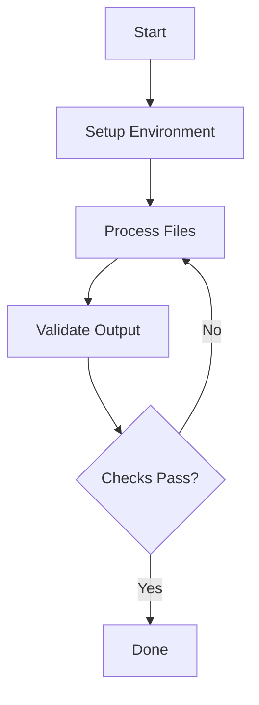

# Stage: Environment Setup
This stage prepares your local environment before processing begins. Run these steps once per project.

### Step 1: Create Output Directory
Create the target directory where all processed files will be written.

```bash
mkdir -p {{OUTPUT_DIR=/tmp/output}}
```

### Step 2: Verify Python Version
Confirm the Python version matches requirements (3.8+ recommended).

```bash
python --version
```

### Step 3: Install Dependencies
Install the required packages into the working environment.

```bash
pip install -r {{REQUIREMENTS_FILE=requirements.txt}}
```

### Step 4: Workflow Overview
The following diagram shows the overall processing pipeline for this project.


