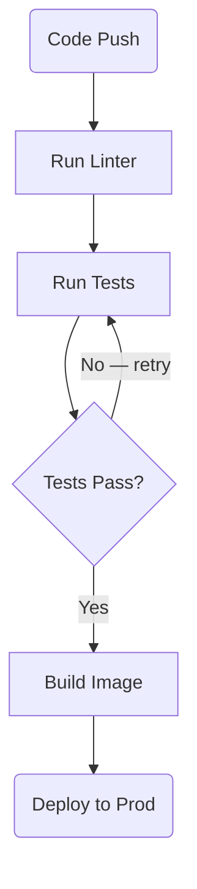
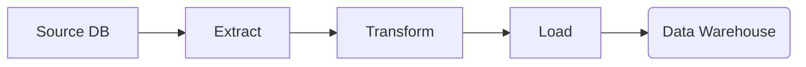
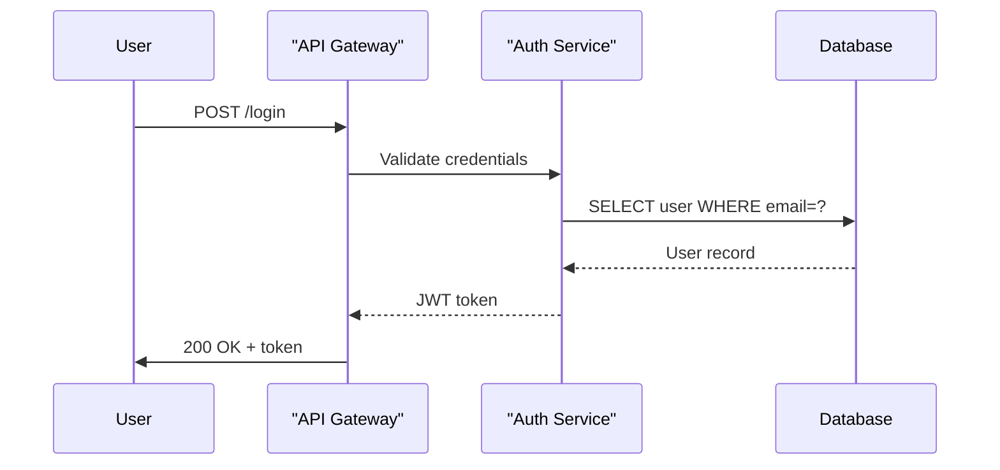

# Stage Builder — User Guide

`stage_builder.html` is a browser-only form that lets you build `.md` stage files for **workflow_builder** without writing Markdown by hand. Fill in structured inputs on the left; the ready-to-use Markdown appears live on the right.

No server, no installation — just open the file in a browser.

---

## Opening the tool

```
workflow_builder/
└── stage_builder.html   ← double-click to open
```

Works fully offline except for Mermaid live previews, which need an internet connection to load the Mermaid CDN library.

---

## Layout at a glance

```
┌─────────────────────────────────┬──────────────────────────────────┐
│  FORM (left, scrollable)        │  PREVIEW (right, dark)           │
│                                 │                                   │
│  Stage name   [____________]    │  # Stage: Environment Setup       │
│  Description  [____________]    │  This stage prepares...           │
│                                 │                                   │
│  ┌─ Step 1 ──────────────────┐  │  ### Step 1: Create Directory     │
│  │ Title  [_______________]  │  │  Create the target directory.     │
│  │ Desc   [_______________]  │  │                                   │
│  │ ┌ Block: [bash ▼]       ┐ │  │  ```bash                         │
│  │ │ [textarea            ] │ │  │  mkdir -p {{OUTPUT_DIR}}          │
│  │ └───────────────────────┘ │  │  ```                              │
│  │ [+ Add Block] [✕ Remove]  │  │                                   │
│  └───────────────────────────┘  │  [Copy Markdown]  [⬇ Download]   │
│  [+ Add Step]                   │  01_environment-setup.md          │
│  File prefix  [01]              │                                   │
└─────────────────────────────────┴───────────────────────────────────┘
```

---

## Step-by-step walkthrough

### 1. Stage name and description

| Field | What to enter | Example |
|---|---|---|
| **Stage name** | Short title for this stage | `Environment Setup` |
| **Description** | 1–3 sentences explaining what this stage does | `Prepares the output directory and installs dependencies.` |

The stage name becomes the `# Stage:` heading in the Markdown. The description is the paragraph that appears below it.

---

### 2. Steps

Each step maps to a `### Step N:` heading.

- Click **+ Add Step** to add a new step.
- Fill in the **title** (appears in the heading) and an optional **description**.
- Steps are numbered automatically — removing Step 2 when Steps 1, 2, 3 exist renumbers them to 1, 2.

---

### 3. Blocks inside a step

Each step can have one or more blocks. Click **+ Add Block** inside a step.

| Block type | Border color | When to use | Output |
|---|---|---|---|
| **bash** | Green | Shell commands the user will run | Fenced ` ```bash ` block with Copy button in the viewer |
| **text** | Gray | Extra explanation, notes, warnings | Plain paragraph |
| **mermaid** | Purple | Architecture or flow diagrams | Fenced ` ```mermaid ` block, rendered as a diagram in the viewer |

---

### 4. Dynamic parameters (placeholders)

Inside any `bash` block, use `{{PARAM_NAME}}` to mark a value that changes per project.

```bash
python process.py --input {{INPUT_DIR}} --output {{OUTPUT_DIR=/tmp/output}} --workers {{WORKERS=4}}
```

- `{{INPUT_DIR}}` — required, no default (highlighted orange in the viewer until filled)
- `{{OUTPUT_DIR=/tmp/output}}` — has a default; pre-filled in the viewer's parameter panel
- `{{WORKERS=4}}` — has a default

Parameters are collected automatically by `build.py` when it reads the `.md` file — you don't declare them anywhere else.

---

### 5. File prefix and download

| Field | Purpose | Example |
|---|---|---|
| **File prefix** | Controls sort order when `build.py` reads the folder | `01`, `02`, `03` |

The suggested filename updates live: `01_environment-setup.md`

- **Copy Markdown** — copies the full Markdown text to the clipboard.
- **Download** — saves the `.md` file to your downloads folder with the suggested name.

---

### 6. Using the file

Drop the downloaded `.md` file into your workflow folder and run `build.py`:

```bash
python build.py my_workflow/ --output my_workflow.html
```

---

## Building Mermaid diagrams

The Mermaid builder replaces the plain textarea when you select **mermaid** as the block type. You choose the diagram type and fill in structured inputs — the Mermaid source and a live preview update automatically.

### Choosing a diagram type

| Diagram type | Best for |
|---|---|
| **Flowchart TD** (top-down) | Sequential pipelines, step-by-step processes |
| **Flowchart LR** (left-right) | Wide data flows, component relationships |
| **Sequence** | Service interactions, request/response flows |

---

### Flowchart diagrams

#### Nodes

Add one row per box in the diagram.

| Field | What to enter |
|---|---|
| **ID** | Short alphanumeric identifier, no spaces: `A`, `B`, `Setup`, `CheckDB` |
| **Label** | The text shown inside the box |
| **Shape** | Choose from the four shapes below |

| Shape | Mermaid output | Use for |
|---|---|---|
| rect (default) | `A[Label]` | Regular steps, tasks |
| rounded | `A(Label)` | Start/end nodes, softer stages |
| diamond | `A{Label}` | Decisions, yes/no branches |
| circle | `A((Label))` | Connectors, terminal points |

#### Edges

Add one row per arrow between nodes.

| Field | What to enter |
|---|---|
| **From** | Select source node from the dropdown (populated from your nodes) |
| **To** | Select destination node |
| **Label** | Optional text shown on the arrow |

Edge with no label → `A --> B`
Edge with label `Retry` → `A -->|Retry| B`

#### Example: CI/CD pipeline (Flowchart TD)

Nodes:

| ID | Label | Shape |
|---|---|---|
| Push | Code Push | rounded |
| Lint | Run Linter | rect |
| Test | Run Tests | rect |
| Pass | Tests Pass? | diamond |
| Build | Build Image | rect |
| Deploy | Deploy to Prod | rounded |

Edges:

| From | To | Label |
|---|---|---|
| Push | Lint | |
| Lint | Test | |
| Test | Pass | |
| Pass | Build | Yes |
| Pass | Test | No — retry |
| Build | Deploy | |

Generated Markdown:

````markdown

````

Rendered diagram:

```
Code Push → Run Linter → Run Tests → Tests Pass?
                                         ↓ Yes        ↓ No
                                     Build Image → Deploy     (retry loop back)
```

---

#### Example: Data flow (Flowchart LR)

Nodes:

| ID | Label | Shape |
|---|---|---|
| Src | Source DB | rect |
| Ext | Extract | rect |
| Tr | Transform | rect |
| Ld | Load | rect |
| DW | Data Warehouse | rounded |

Edges: Src→Ext, Ext→Tr, Tr→Ld, Ld→DW (all no labels)

Generated:

````markdown

````

---

### Sequence diagrams

#### Actors

Add one row per participant (service, user, system). Order matters — actors appear left to right.

Actor names with spaces are automatically quoted in the Mermaid output.

#### Messages

Add one row per message between actors.

| Field | What to enter |
|---|---|
| **From** | Sending actor (dropdown) |
| **Arrow** | `->` for solid request, `-->` for dashed response |
| **To** | Receiving actor (dropdown) |
| **Message** | The label on the arrow |

| Arrow choice | Mermaid syntax | Meaning |
|---|---|---|
| `->` | `->>` | Solid arrowhead — request, command, call |
| `-->` | `-->>` | Dashed arrowhead — response, reply, ack |

#### Example: Login flow

Actors: `User`, `API Gateway`, `Auth Service`, `Database`

Messages:

| From | Arrow | To | Message |
|---|---|---|---|
| User | -> | API Gateway | POST /login |
| API Gateway | -> | Auth Service | Validate credentials |
| Auth Service | -> | Database | SELECT user WHERE email=? |
| Database | --> | Auth Service | User record |
| Auth Service | --> | API Gateway | JWT token |
| API Gateway | --> | User | 200 OK + token |

Generated Markdown:

````markdown

````

---

### Tips for clean diagrams

**Keep node IDs short** — they appear in every edge row. Use `A`, `B`, `DB`, `API` rather than long names. Put the full name in the Label field.

**Use diamond nodes for decisions** — a diamond with two outgoing edges (one labeled `Yes`, one `No`) makes branching obvious at a glance.

**Flowchart LR for wide flows** — if you have more than 5–6 nodes in a chain, LR fits better in the viewer without wrapping.

**Sequence for service boundaries** — whenever the diagram is about messages crossing between systems or services, sequence diagrams are clearer than flowcharts.

**One diagram per step** — a diagram embedded in a step visually belongs to that step. Don't put one diagram that covers the whole stage in the first step and then refer to it later.

**Test the download immediately** — after downloading, drop the file into `sample_workflow/`, run `python build.py sample_workflow --output test.html`, and open `test.html` to confirm the diagram renders correctly in the viewer.

---

## Common mistakes

| Mistake | Fix |
|---|---|
| Node ID has a space: `My Node` | Use a single word or camelCase: `MyNode` or `Proc` |
| Edge dropdown shows no options | Add at least one node row first — dropdowns are populated from nodes |
| Diagram shows ⚠ syntax error | Check that all node IDs referenced in edges exist in the nodes table |
| Downloaded file not parsed by build.py | Make sure the Stage name field is filled — build.py requires `# Stage: Name` as the first line |
| Parameters not showing in viewer | Check spelling: `{{OUTPUT_DIR}}` in bash block must match exactly (case-sensitive) |
| Steps out of order | Use the file prefix (`01`, `02`, ...) — build.py sorts files alphabetically |

---

## Full example session

**Goal:** Create `02_process.md` — a stage that runs a processing script.

1. Open `stage_builder.html` in browser.
2. Stage name: `Process Files`
3. Description: `Runs the main processing script and verifies the output.`
4. File prefix: `02`
5. Add Step 1:
   - Title: `Run processing script`
   - Description: `This may take several minutes depending on input size.`
   - Add bash block:
     ```
     python process.py --input {{INPUT_DIR}} --output {{OUTPUT_DIR=/tmp/output}} --workers {{WORKERS=4}}
     ```
6. Add Step 2:
   - Title: `Verify output`
   - Add bash block:
     ```
     ls -lh {{OUTPUT_DIR=/tmp/output}}
     ```
7. Add Step 3:
   - Title: `Pipeline overview`
   - Add mermaid block → Flowchart TD:
     - Nodes: `In[Input Files]`, `Proc[Process]`, `Out(Output)`
     - Edges: In→Proc, Proc→Out
8. Click **Download** → saves `02_process.md`
9. Run:
   ```
   python build.py my_workflow/ --output my_workflow.html
   ```

The viewer will show the stage with live-substituting commands and the rendered flowchart.
